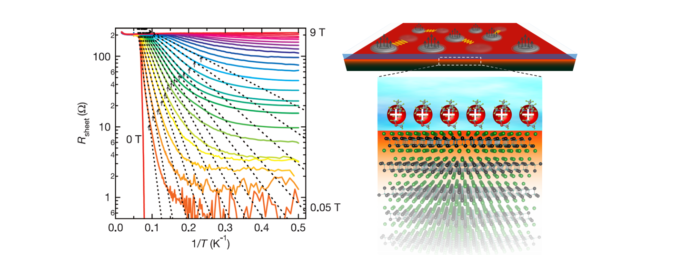

## Selected Papers

Publications
**Isospin Pomeranchuk effect in twisted bilayer graphene** 
    **Y. Saito**+, F. Wang+, J. Ge, X. Liu, T. Taniguchi, K. Watanabe, J.I.A. Li, E. Berg, A. F. Young 
    [*Nature* **592**, 220-224 (2020).](https://www.nature.com/articles/s41586-021-03409-2)

**Hofstadter subband ferromagnetism and symmetry broken Chern insulators in twisted bilayer graphene** 
**Y. Saito**, J. Ge, L. Rademaker, K. Watanabe, T. Taniguchi, D. A. Abanin, A. F. Young 
[*Nature Physics* **17**, 478-481 (2020).](https://www.nature.com/articles/s41567-020-01129-4)

**Independent superconductors and correlated insulators in twisted bilayer graphene** 
**Y. Saito**, J. Ge, K. Watanabe, T. Taniguchi, A. F. Young 
[*Nature Physics* **16**, 926-930 (2020).](https://www.nature.com/articles/s41567-020-0928-3) 

 **Quantum phase transitions in highly crystalline two-dimensional superconductors **
**Y. Saito** T. Nojima and Y. Iwasa 
[*Nature Communications* **9**, 778 (2018).](https://www.nature.com/articles/s41467-018-03275-z)

According to the magneto-transport studies in 2D superconducting ZrNCl and MoS2, we found that the quantum metallic state commonly observed at low magnetic fields is converted via the quantum Griffiths state to the weakly localized metal at high magnetic fields. The scaling behavior, characterized by the diverging dynamical critical exponent (Griffiths singularity), indicates that the quantum fluctuation manifests itself as superconducting puddles. The present results suggest that an evolution from the quantum metallic to the quantum Griffiths state is generic nature in highly crystalline 2D superconductors with weak pinning potentials.

**Superconductivity protected by spin-valley locking in ion-gated MoS2 **
**Y. Saito**, Y. Nakamura, M. S. Bahramy, Y. Kohama, J. T. Ye, Y. Kasahara, Y. Nakagawa, M. Onga, M. Tokunaga, T. Nojima, Y. Yanase and Y. Iwasa 
[*Nature Physics* **12**, 144ー149 (2016).](https://www.nature.com/articles/nphys3580

Perspective “Opening the gate on superconductivity” Science 350, 1316ー1317 (2015).
News and Views “Two-dimensional superconductivity: The Ising on the monolayer” Nature Physics 12, 112ー113 (2016).
UTokyo Research “2D superconductor surviving in high magnetic fields over 50 Tesla” (Link)

By performing pulsed high-magnetic-field measurements up to 55 Tesla, we found that the gate-induced superconductivity in MoS2 single crystals exhibits an anomalously large upper critical field of approximately 52 T, which indicates an enhancement of the Pauli limit by a factor of four compared to the conventional one. Combined with first-principles calculation and associated realistic tight-binding calculations based numerical estimation of the upper critical field, we reveal that this unusual behavior is due to an inter-valley Cooper pairing that is protected by spin-valley locking originating from inplane mirror symmetry breaking in MoS2 single layer and strong spin-orbit coupling (Ising supercoductivtiy).

**Metallic ground state in an ion-gated two-dimensional superconductor **
**Y. Saito**, Y. Kasahara, J. T. Ye, Y. Iwasa and T. Nojima 
[*Science* **350**, 409-413 (2015).](https://science.sciencemag.org/content/350/6259/409)

UTokyo Research “The ultimate 2D superconductor” (Link)
Highlighted in Asian Scientist as “A Minimally Disordered 2D Superconductor” (Link)

We found that an ion-gated ZrNCl single crystal, exhibiting a dome-shaped phase diagram (Tc vs carrier density), becomes a truly 2D crystalline superconductor with the effective superconducting thickness of 1.8 nanometers, which is thinner than one-unit-cell. In particular, we discovered that the zero resistance state is immediately destroyed by the application of out-of-plane magnetic fields, and consequently, a quantum metallic state is stabilized in a wide range of magnetic fields. We concluded that this quantum metallic is caused by the quantum tunneling of vortices due to the extremely weak pinning and disorder.

## Full Publication List

1. **Isospin Pomeranchuk effect in twisted bilayer graphene** 
    **Y. Saito**+, F. Wang+, J. Ge, X. Liu, T. Taniguchi, K. Watanabe, J.I.A. Li, E. Berg, A. F. Young 
    [*Nature* **592**, 220-224 (2020).](https://www.nature.com/articles/s41586-021-03409-2)
2. **Hofstadter subband ferromagnetism and symmetry broken Chern insulators in twisted bilayer graphene** 
**Y. Saito**, J. Ge, L. Rademaker, K. Watanabe, T. Taniguchi, D. A. Abanin, A. F. Young 
[*Nature Physics* **17**, 478-481 (2020).](https://www.nature.com/articles/s41567-020-01129-4)
1. **Independent superconductors and correlated insulators in twisted bilayer graphene** 
**Y. Saito**, J. Ge, K. Watanabe, T. Taniguchi, A. F. Young 
[*Nature Physics* **16**, 926-930 (2020).](https://www.nature.com/articles/s41567-020-0928-3) 
1. **Dynamical vortex phase diagram of two-dimensional superconductivity in gated MoS2 **
**Y. Saito**, Y. M. Itahashi, T. Nojima and Y. Iwasa  
[*Physical Review Materials* **4**, 074003 (2020).](https://journals.aps.org/prmaterials/abstract/10.1103/PhysRevMaterials.4.074003)
1. **Quantum and classical ratchet motions of vortices in a 2D trigonal superconductor **
Y. M. Itahashi+, **Y. Saito**+, T. Nojima, T. Ideue and Y. Iwasa 
[*Physical Review Research* **2**, 023127 (2020)](https://journals.aps.org/prresearch/abstract/10.1103/PhysRevResearch.2.023127)
1. **Nonreciprocal transport in gate-induced polar superconductor SrTiO3** 
Y. M. Itahashi, T. Ideue, **Y. Saito**, S. Shimizu, T. Ouchi, T. Nojima and Y. Iwasa 
[*Science Advances* **6**, eaay9120 (2020).](https://advances.sciencemag.org/content/6/13/eaay9120)
1. **Deep learning-based quality filtering of mechanically exfoliated 2D crystals **
**Y. Saito**+, Kento Shin+, Kei Terayama, Shaan Desai, Masaru Onga, Yuji Nakagawa,
Yuki M. Itahashi, Yoshihiro Iwasa, Makoto Yamada, Koji Tsuda 
[*npj Computational Materials* **5**, 124 (2019).](https://www.nature.com/articles/s41524-019-0262-4)
1. **Gate-controlled  low  carrier  density  superconductors: Toward  the  two-dimensional BCS-BEC crossover **
Y. Nakagawa, **Y. Saito**, T. Nojima, K. Inumaru, S. Yamanaka and, Y. Kasahara and Y. Iwasa 
[*Physical Review B* **98**, 064512 (2018).](https://journals.aps.org/prb/abstract/10.1103/PhysRevB.98.064512)
1. **Electric-field-control of electronic states in WS2 nanodevices by electrolyte gating **
F. Qin, T. Ideue, W. Shi, Y. Zhang, R. Suzuki, M. Yoshida, **Y. Saito** and Y. Iwasa 
[*Journal of Visualized Experiments* **134**, e56862 (2018).](https://www.jove.com/t/56862/electric-field-control-electronic-states-ws2-nanodevices-electrolyte)
1. **Quantum phase transitions in highly crystalline two-dimensional superconductors **
**Y. Saito** T. Nojima and Y. Iwasa 
[*Nature Communications* **9**, 778 (2018).](https://www.nature.com/articles/s41467-018-03275-z)
1. **Nonreciprocal charge transport in noncentrosymmetric superconductors **
R. Wakatsuki+, **Y. Saito**+, S. Hoshino, Y. M. Itahashi, T. Ideue, M. Ezawa, Y. Iwasa and N. Nagaosa 
[*Science Advances* **3**, e1602390 (2017).](https://advances.sciencemag.org/content/3/4/e1602390)
1. **Highly crystalline 2D superconductors **
**Y. Saito**, T. Nojima, Y. Iwasa 
[*Nature Reviews Materials* **2**, 16094 (2016).](https://www.nature.com/articles/natrevmats201694)
1. **Gate-induced superconductivity in two-dimensional atomic crystals **
**Y. Saito**, T. Nojima, Y. Iwasa 
[*Superconductor Science and Technology* (SUST) **29**, 093001 (2016).](https://iopscience.iop.org/article/10.1088/0953-2048/29/9/093001)
1. **Gate-tuned thermoelectric power in black phosphorus **
**Y. Saito**+, T. Iizuka+, T. Koretsune, R. Arita, S. Shimizu, and Y. Iwasa 
[*Nano Letters* **16**, 4819-4824 (2016).](https://pubs.acs.org/doi/abs/10.1021/acs.nanolett.6b00999)
1. **Gate-optimized thermoelectric power factor in ultrathin WSe2 single crystals **
M. Yoshida, T. Iizuka, **Y. Saito**, M. Onga, R. Suzuki, Y. J. Zhang, Y. Iwasa and S. Shimizu 
[*Nano Letters* **16**, 2061-2065 (2016).](https://pubs.acs.org/doi/abs/10.1021/acs.nanolett.6b00075)
1. **Superconductivity protected by spin-valley locking in ion-gated MoS2 **
**Y. Saito**, Y. Nakamura, M. S. Bahramy, Y. Kohama, J. T. Ye, Y. Kasahara, Y. Nakagawa, M. Onga, M. Tokunaga, T. Nojima, Y. Yanase and Y. Iwasa 
[*Nature Physics* **12**, 144ー149 (2016).](https://www.nature.com/articles/nphys3580)
1. **Metallic ground state in an ion-gated two-dimensional superconductor **
**Y. Saito**, Y. Kasahara, J. T. Ye, Y. Iwasa and T. Nojima 
[*Science* **350**, 409-413 (2015).](https://science.sciencemag.org/content/350/6259/409)
1. **Superconductivity series in transition metal dichalcogenides by ionic gating **
W. Shi, J. T. Ye, Y. J. Zhang, R. Suzuki, M. Yoshida, J. Miyazaki, N. Inoue, **Y. Saito** and Y. Iwasa 
[*Scientific Reports* **5**, 12534 (2015).](https://www.nature.com/articles/srep12534)
1. **Ambipolar insulator-to-metal transition in black phosphorus by ionic-liquid gating **
**Y. Saito** and Y. Iwasa 
[*ACS Nano* **9**, 3192-3198 (2015).](https://pubs.acs.org/doi/abs/10.1021/acsnano.5b00497)
