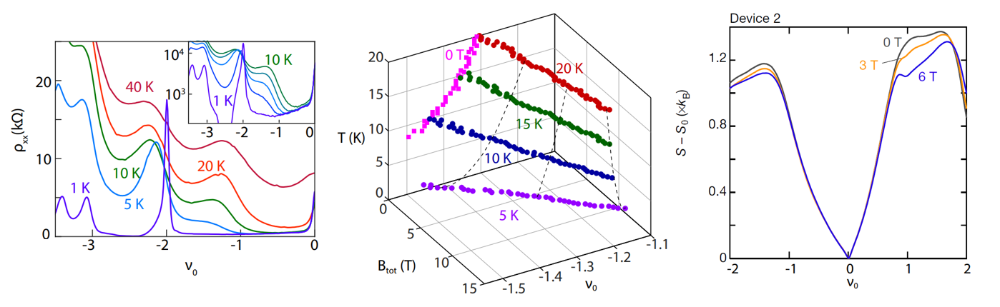

## Selected Papers

+ equal contribution

**Isospin Pomeranchuk effect in twisted bilayer graphene** 
    **Y. Saito**+, F. Wang+, J. Ge, X. Liu, T. Taniguchi, K. Watanabe, J.I.A. Li, E. Berg, A. F. Young 
    [*Nature* **592**, 220-224 (2021).](https://www.nature.com/articles/s41586-021-03409-2) ([arXiv PDF](https://arxiv.org/pdf/2008.10830.pdf))

In condensed-matter systems, higher temperatures typically disfavour ordered phases, leading to an upper critical temperature for magnetism, superconductivity and other phenomena. An exception is the Pomeranchuk effect in 3He, in which the liquid ground state freezes upon increasing the temperature, owing to the large entropy of the paramagnetic solid phase. Here we show that a similar mechanism describes the finite-temperature dynamics of spin and valley isospins in magic-angle twisted bilayer graphene. Notably, a resistivity peak appears at high temperatures near a superlattice filling factor of −1, despite no signs of a commensurate correlated phase appearing in the low-temperature limit. Tilted-field magnetotransport and thermodynamic measurements of the in-plane magnetic moment show that the resistivity peak is connected to a finite-field magnetic phase transition at which the system develops finite isospin polarization. These data are suggestive of a Pomeranchuk-type mechanism, in which the entropy of disordered isospin moments in the ferromagnetic phase stabilizes the phase relative to an isospin-unpolarized Fermi liquid phase at higher temperatures. We find the entropy, in units of Boltzmann’s constant, to be of the order of unity per unit cell area, with a measurable fraction that is suppressed by an in-plane magnetic field consistent with a contribution from disordered spins.

**News and Views** ["Heating freezes electrons in twisted bilayer graphene" *Nature* **592**, 851 (2021)](https://www.nature.com/articles/d41586-021-00843-0) 
**Physics World** ["Electrons in twisted graphene ‘freeze’ when heated"](https://physicsworld.com/a/electrons-in-twisted-graphene-freeze-when-heated/) 
**Phys Org** ["A graphene system that freezes electrons as the temperature rises"](https://phys.org/news/2021-04-graphene-electrons-temperature.html) 
Highlighted in [Journal Club for Condensed Matter Physics](https://www.condmatjclub.org/?p=4312)

**Hofstadter subband ferromagnetism and symmetry broken Chern insulators in twisted bilayer graphene** 
**Y. Saito**, J. Ge, L. Rademaker, K. Watanabe, T. Taniguchi, D. A. Abanin, A. F. Young 
[*Nature Physics* **17**, 478-481 (2021).](https://www.nature.com/articles/s41567-020-01129-4) ([arXiv PDF](https://arxiv.org/pdf/2007.06115.pdf))

When the twist angle between two layers of graphene is approximately 1.1°, interlayer tunnelling and rotational misalignment conspire to create a pair of flat bands that are known to host various insulating, superconducting and magnetic states when they are partially filled. Most work has focused on the zero-magnetic-field phase diagram, but here we show that twisted bilayer graphene in a finite magnetic field hosts a cascade of ferromagnetic Chern insulators with Chern number ∣C∣ = 1, 2 and 3. The emergence of the Chern insulators is driven by the interplay of the moiré superlattice with the magnetic field, which endows the flat bands with a substructure of topologically non-trivial subbands characteristic of the Hofstadter butterfly. The new phases can be accounted for in a Stoner picture; in contrast to conventional quantum Hall ferromagnets, electrons polarize into between one and four copies of a single Hofstadter subband. Distinct from other moiré heterostructures, Coulomb interactions dominate in twisted bilayer graphene, as manifested by the appearance of Chern insulating states with spontaneously broken superlattice symmetry at half filling of a C = −2 subband.

**Independent superconductors and correlated insulators in twisted bilayer graphene** 
**Y. Saito**, J. Ge, K. Watanabe, T. Taniguchi, A. F. Young 
[*Nature Physics* **16**, 926-930 (2020).](https://www.nature.com/articles/s41567-020-0928-3) ([arXiv PDF](https://arxiv.org/pdf/1911.13302.pdf))

When two sheets of graphene are stacked on top of each other with a small twist of angle θ ≈ 1.1° between them, theory predicts the formation of a flat electronic band. Experiments have shown correlated insulating, superconducting and ferromagnetic states when the flat band is partially filled. The proximity of superconductivity to correlated insulators suggested a close relationship between these states, reminiscent of the cuprates where superconductivity arises by doping a Mott insulator. Here, we show that superconductivity can appear far away from the correlated insulating states. Although both superconductivity and correlated insulating behaviour are strongest near the flat-band condition, superconductivity survives to larger detuning of the angle. Our observations are consistent with a ‘competing phases’ picture in which insulators and superconductivity arise from different mechanisms.

Highlighted in [Journal Club for Condensed Matter Physics](https://www.condmatjclub.org/?p=4208)

 **Quantum phase transitions in highly crystalline two-dimensional superconductors **
**Y. Saito** T. Nojima and Y. Iwasa 
[*Nature Communications* **9**, 778 (2018).](https://www.nature.com/articles/s41467-018-03275-z) ([arXiv PDF](https://arxiv.org/ftp/arxiv/papers/1804/1804.07218.pdf))

According to the magneto-transport studies in 2D superconducting ZrNCl and MoS2, we found that the quantum metallic state commonly observed at low magnetic fields is converted via the quantum Griffiths state to the weakly localized metal at high magnetic fields. The scaling behavior, characterized by the diverging dynamical critical exponent (Griffiths singularity), indicates that the quantum fluctuation manifests itself as superconducting puddles. The present results suggest that an evolution from the quantum metallic to the quantum Griffiths state is generic nature in highly crystalline 2D superconductors with weak pinning potentials.

**Superconductivity protected by spin-valley locking in ion-gated MoS2 **
**Y. Saito**, Y. Nakamura, M. S. Bahramy, Y. Kohama, J. T. Ye, Y. Kasahara, Y. Nakagawa, M. Onga, M. Tokunaga, T. Nojima, Y. Yanase and Y. Iwasa 
[*Nature Physics* **12**, 144-149 (2016).](https://www.nature.com/articles/nphys3580) ([arXiv PDF](https://arxiv.org/ftp/arxiv/papers/1506/1506.04146.pdf))

**News and Views** [“The Ising on the monolayer” *Nature Physics* **12**, 112-113 (2016)](https://www.nature.com/articles/nphys3647). 
**UTokyo Research** [“2D superconductor surviving in high magnetic fields over 50 Tesla”](https://www.u-tokyo.ac.jp/focus/en/articles/a_00435.html)

By performing pulsed high-magnetic-field measurements up to 55 Tesla, we found that the gate-induced superconductivity in MoS2 single crystals exhibits an anomalously large upper critical field of approximately 52 T, which indicates an enhancement of the Pauli limit by a factor of four compared to the conventional one. Combined with first-principles calculation and associated realistic tight-binding calculations based numerical estimation of the upper critical field, we reveal that this unusual behavior is due to an inter-valley Cooper pairing that is protected by spin-valley locking originating from inplane mirror symmetry breaking in MoS2 single layer and strong spin-orbit coupling (Ising supercoductivtiy).

**Metallic ground state in an ion-gated two-dimensional superconductor **
**Y. Saito**, Y. Kasahara, J. T. Ye, Y. Iwasa and T. Nojima 
[*Science* **350**, 409-413 (2015).](https://science.sciencemag.org/content/350/6259/409) ([arXiv PDF](https://arxiv.org/ftp/arxiv/papers/1511/1511.03266.pdf))

**UTokyo Research** [“The ultimate 2D superconductor”](https://www.u-tokyo.ac.jp/focus/en/articles/a_00420.html) 
**Highlighted in Asian Scientist** as [“A Minimally Disordered 2D Superconductor”](https://www.asianscientist.com/2015/10/in-the-lab/minimally-disordered-2d-superconduct/) 

We found that an ion-gated ZrNCl single crystal, exhibiting a dome-shaped phase diagram (Tc vs carrier density), becomes a truly 2D crystalline superconductor with the effective superconducting thickness of 1.8 nanometers, which is thinner than one-unit-cell. In particular, we discovered that the zero resistance state is immediately destroyed by the application of out-of-plane magnetic fields, and consequently, a quantum metallic state is stabilized in a wide range of magnetic fields. We concluded that this quantum metallic is caused by the quantum tunneling of vortices due to the extremely weak pinning and disorder.

## Full Publication List
1. **Isospin magnetism and spin-triplet superconductivity in Bernal bilayer graphene** 
H. Zhou, **Y. Saito**, L. A. Cohen, W. Huynh, C. L. Patterson, F. Yang, T. Taniguchi, K. Watanabe, A. F. Young 
[arXiv:2110.11317](https://arxiv.org/abs/2110.11317)
2. **Isospin Pomeranchuk effect in twisted bilayer graphene** 
**Y. Saito**+, F. Wang+, J. Ge, X. Liu, T. Taniguchi, K. Watanabe, J.I.A. Li, E. Berg, A. F. Young 
[*Nature* **592**, 220-224 (2021).](https://www.nature.com/articles/s41586-021-03409-2)
3. **Hofstadter subband ferromagnetism and symmetry broken Chern insulators in twisted bilayer graphene** 
**Y. Saito**, J. Ge, L. Rademaker, K. Watanabe, T. Taniguchi, D. A. Abanin, A. F. Young 
[*Nature Physics* **17**, 478-481 (2021).](https://www.nature.com/articles/s41567-020-01129-4)
1. **Independent superconductors and correlated insulators in twisted bilayer graphene** 
**Y. Saito**, J. Ge, K. Watanabe, T. Taniguchi, A. F. Young 
[*Nature Physics* **16**, 926-930 (2020).](https://www.nature.com/articles/s41567-020-0928-3) 
1. **Dynamical vortex phase diagram of two-dimensional superconductivity in gated MoS2 **
**Y. Saito**, Y. M. Itahashi, T. Nojima and Y. Iwasa  
[*Physical Review Materials* **4**, 074003 (2020).](https://journals.aps.org/prmaterials/abstract/10.1103/PhysRevMaterials.4.074003)
1. **Quantum and classical ratchet motions of vortices in a 2D trigonal superconductor **
Y. M. Itahashi+, **Y. Saito**+ (co-first), T. Nojima, T. Ideue and Y. Iwasa 
[*Physical Review Research* **2**, 023127 (2020)](https://journals.aps.org/prresearch/abstract/10.1103/PhysRevResearch.2.023127)
1. **Nonreciprocal transport in gate-induced polar superconductor SrTiO3** 
Y. M. Itahashi, T. Ideue, **Y. Saito**, S. Shimizu, T. Ouchi, T. Nojima and Y. Iwasa 
[*Science Advances* **6**, eaay9120 (2020).](https://advances.sciencemag.org/content/6/13/eaay9120)
1. **Deep learning-based quality filtering of mechanically exfoliated 2D crystals **
**Y. Saito**+, Kento Shin+, Kei Terayama, Shaan Desai, Masaru Onga, Yuji Nakagawa,
Yuki M. Itahashi, Yoshihiro Iwasa, Makoto Yamada, Koji Tsuda .
[*npj Computational Materials* **5**, 124 (2019).](https://www.nature.com/articles/s41524-019-0262-4)
1. **Gate-controlled  low  carrier  density  superconductors: Toward  the  two-dimensional BCS-BEC crossover **
Y. Nakagawa, **Y. Saito**, T. Nojima, K. Inumaru, S. Yamanaka and, Y. Kasahara and Y. Iwasa 
[*Physical Review B* **98**, 064512 (2018).](https://journals.aps.org/prb/abstract/10.1103/PhysRevB.98.064512)
1. **Electric-field-control of electronic states in WS2 nanodevices by electrolyte gating **
F. Qin, T. Ideue, W. Shi, Y. Zhang, R. Suzuki, M. Yoshida, **Y. Saito** and Y. Iwasa 
[*Journal of Visualized Experiments* **134**, e56862 (2018).](https://www.jove.com/t/56862/electric-field-control-electronic-states-ws2-nanodevices-electrolyte)
1. **Quantum phase transitions in highly crystalline two-dimensional superconductors **
**Y. Saito** T. Nojima and Y. Iwasa 
[*Nature Communications* **9**, 778 (2018).](https://www.nature.com/articles/s41467-018-03275-z)
1. **Nonreciprocal charge transport in noncentrosymmetric superconductors **
R. Wakatsuki+, **Y. Saito**+ (co-first), S. Hoshino, Y. M. Itahashi, T. Ideue, M. Ezawa, Y. Iwasa and N. Nagaosa 
[*Science Advances* **3**, e1602390 (2017).](https://advances.sciencemag.org/content/3/4/e1602390)
1. **Highly crystalline 2D superconductors **
**Y. Saito**, T. Nojima, Y. Iwasa 
[*Nature Reviews Materials* **2**, 16094 (2016).](https://www.nature.com/articles/natrevmats201694)
1. **Gate-induced superconductivity in two-dimensional atomic crystals **
**Y. Saito**, T. Nojima, Y. Iwasa 
[*Superconductor Science and Technology* (SUST) **29**, 093001 (2016).](https://iopscience.iop.org/article/10.1088/0953-2048/29/9/093001)
1. **Gate-tuned thermoelectric power in black phosphorus **
**Y. Saito**+, T. Iizuka+, T. Koretsune, R. Arita, S. Shimizu, and Y. Iwasa 
[*Nano Letters* **16**, 4819-4824 (2016).](https://pubs.acs.org/doi/abs/10.1021/acs.nanolett.6b00999)
1. **Gate-optimized thermoelectric power factor in ultrathin WSe2 single crystals **
M. Yoshida, T. Iizuka, **Y. Saito**, M. Onga, R. Suzuki, Y. J. Zhang, Y. Iwasa and S. Shimizu 
[*Nano Letters* **16**, 2061-2065 (2016).](https://pubs.acs.org/doi/abs/10.1021/acs.nanolett.6b00075)
1. **Superconductivity protected by spin-valley locking in ion-gated MoS2 **
**Y. Saito**, Y. Nakamura, M. S. Bahramy, Y. Kohama, J. T. Ye, Y. Kasahara, Y. Nakagawa, M. Onga, M. Tokunaga, T. Nojima, Y. Yanase and Y. Iwasa 
[*Nature Physics* **12**, 144-149 (2016).](https://www.nature.com/articles/nphys3580)
1. **Metallic ground state in an ion-gated two-dimensional superconductor **
**Y. Saito**, Y. Kasahara, J. T. Ye, Y. Iwasa and T. Nojima 
[*Science* **350**, 409-413 (2015).](https://science.sciencemag.org/content/350/6259/409)
1. **Superconductivity series in transition metal dichalcogenides by ionic gating **
W. Shi, J. T. Ye, Y. J. Zhang, R. Suzuki, M. Yoshida, J. Miyazaki, N. Inoue, **Y. Saito** and Y. Iwasa 
[*Scientific Reports* **5**, 12534 (2015).](https://www.nature.com/articles/srep12534)
1. **Ambipolar insulator-to-metal transition in black phosphorus by ionic-liquid gating **
**Y. Saito** and Y. Iwasa 
[*ACS Nano* **9**, 3192-3198 (2015).](https://pubs.acs.org/doi/abs/10.1021/acsnano.5b00497)
