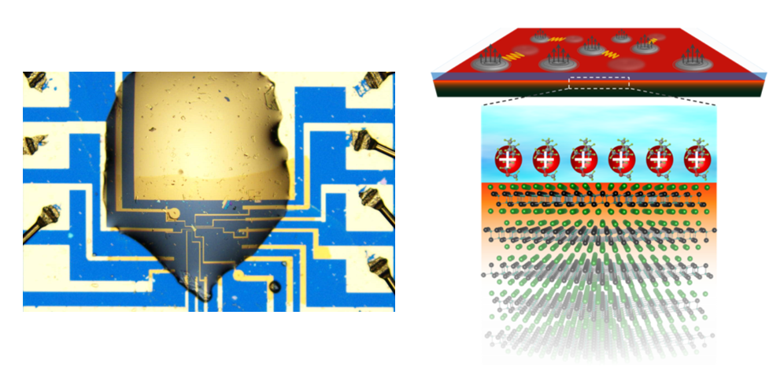

## Twisted bilayer graphene (at UC Santa Barbara)
Low-density flat-band systems play a crucial role in making the sytem strongly correlated because the energy range of the band is so narrow that the Coulomb interactions dominate over kinetic energy. Recently, twisting two graphene layers to close to 1.1 degrees has been found to generates isolated electronic flat bands, which shows half-filling correlated insulator and superconductivity, but the relationship between two states has been unclear. In our work, we showed that superconductivity can obtain in samples with no correlated insulating states at all. We found that while both the insulators and superconductors are strongest near the optimal flat band condition, a narrow regime of twist angles exists in which only superconductivity obtains, which suggest the increased bandwidth suppresses the tendency to polarize ferromagnetically at these angles, but the peak density of states remains large, favoring the fermi surface instability to a superconducting state. In addition, we found that the entropy of spin and valley degrees of freedom is higher than expected, favoring a disordered ferromagnet at high temperatures even as the system is paramagnetic. The physics is similar to that of the Pomeranchuk effect in 3He, in which the liquid freezes as it is heated due to the increased entropy of its nuclear spins.

Related video is available [here](https://online.kitp.ucsb.edu/online/bands-oc20/young/rm/jwvideo.html).

1. Y. Saito et al. [*Nature Physics* **16**, 926-930 (2020).](https://www.nature.com/articles/s41567-020-0928-3) ([arXiv PDF](https://arxiv.org/pdf/1911.13302.pdf))
1. Y. Saito et al. [*Nature Physics* **17**, 478-481 (2021).](https://www.nature.com/articles/s41567-020-01129-4) ([arXiv PDF](https://arxiv.org/pdf/2007.06115.pdf))
2. Y. Saito et al. [*Nature* **592**, 220-224 (2021).](https://www.nature.com/articles/s41586-021-03409-2) ([arXiv PDF](https://arxiv.org/pdf/2008.10830.pdf))

 

The gif image is from http://www.condmat.physics.manchester.ac.uk/cmpimages/GrapheneBNMoire4000x4000.gif 

## Electric-field-induced superconductivity in ionic-liquid gated 2D materials (at the University of Tokyo)
Two-dimensional (2D) crystals are attracting growing interest in condensed matter physics, since these systems exhibit not only rich electronic and photonic properties but also exotic electronic phase transitions including superconductivity and charge density wave. Moreover, owing to the recent development of transfer methods after exfoliation and electric-double-layer transistors, superconducting 2D atomic crystals, the thicknesses of which are below 1–2 nm, have been successfully obtained. We found a a series of their novel properties in 2D crystalline superconductors induced by ionic-liquid gating. In out-of-plane magnetic field, we found quantum metallic states (or possible metallic ground states) and quatum Griffiths state and and also robust superconductivity against in-plane magnetic fields. These phenomena can be discussed with the effects of weakened disorder and/or broken spacial inversion symmetry leading to valley-dependent spin-momentum locking (spin-valley locking). These examples suggest the superconducting 2D crystals are new platforms for investigating the intrinsic quantum phases as well as exotic nature in 2D superconductors.

1. Y. Saito et al. [*Science* **350**, 409-413 (2015).](https://science.sciencemag.org/content/350/6259/409) ([arXiv PDF](https://arxiv.org/ftp/arxiv/papers/1511/1511.03266.pdf))
1. Y. Saito et al. [*Nature Physics* **12**, 144-149 (2016).](https://www.nature.com/articles/nphys3580) ([arXiv PDF](https://arxiv.org/ftp/arxiv/papers/1506/1506.04146.pdf))
2. Y. Saito et al. [*Nature Communications* **9**, 778 (2018).](https://www.nature.com/articles/s41467-018-03275-z) ([arXiv PDF](https://arxiv.org/ftp/arxiv/papers/1804/1804.07218.pdf))

